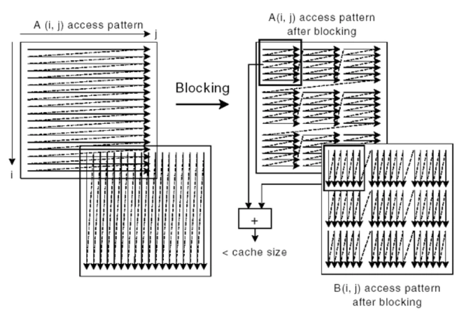

# Coding Style

## Writing cache-friendly code [(link)](https://www.stardog.com/blog/writing-cache-friendly-code/)

### Background

System programmer에 있어 cache friendly한 code를 작성하는 것은 중요하다. CPU register로의 데이터를 쓰는 것은 굉장히 값 비싼 연산이고, register 자체의 수가 굉장히 적기 때문에, 한번 register에 올린 데이터를 계속해서 사용하는 코딩 스타일이 중요하다.

컴퓨터는 값이 비교적 싸고 용량이 큰 RAM과 값이 비싸지만 용량이 작은 register 사이의 간극을 줄이기 위하여 L1, L2, L3 cache를 다루고 있다. 이러한 계층적 캐시 구조를 이용하여 프로그래밍의 처리 속도와 가격 사이의 합리적인 트레이드 오프를 유지하고 있다.

결국, 시스템 프로그래머로써 최적의 코드는 캐시 히트를 최대한 많이 발생시키는 코드이다. 이를 공부한 내용을 본 포스트에서 공유한다.

### locality

이를 위해 가장 중요한 개념은 locality 개념이다. 이는 쉽게 말해, 물리적 저장공간에 데이터를 연속적으로 저장하는 것을 말한다. locality의 원리에서 주요 목표는 결국 register-RAM-cache 구조에서 관련된 데이터를 최대한 가깝게 위치시키는 것을 의미한다.

이러한 locality는 temporal locality와 spatial locality 두가지로 나뉘어 질 수 있다. temporal locality는 간단하게 최근에 호출된 메모리는, 다시 호출될 가능성이 높다는 것이다. spatial locality는 관계된 데이터가 연속적으로 구성되어있음을 의미한다. RAM으로 데이터를 읽을 때, 보통 메모리 덩어리를 가져와서 처리하기 때문에, 데이터가 붙어 있으면 붙어 있을 수록 데이터를 한번에 처리할 수 있을 확률이 높다.

### vector vs list

vector는 메모리 상에 일렬로 데이터를 저장하기 때문에 list 대비 더욱 cache-friendly한 코드를 작성할 수 있다.

### cache blokcing

https://www.intel.com/content/www/us/en/developer/articles/technical/cache-blocking-techniques.html

blocking은 메모리 밴드위스 보틀넥을 회피하도록 돕는 잘 알려진 테크닉이다. 키 아이디어는 재사용 가능한 데이터를 내재적으로 가지게 하는 것. blcoking은 1-D, 2-D, 3-D spatial data 구조에 사용될 수 있다. temporal locality를 이용한다. 

e.g.,

```c++
float A[MAX, MAX], B[MAX, MAX]
for (i=0; i< MAX; i++) {
  for (j=0; j< MAX; j++) {
    A[i,j] = A[i,j] + B[j, i];
  }
}

// 
float A[MAX, MAX], B[MAX, MAX];
for (i=0; i< MAX; i+=block_size) {
  for (j=0; j< MAX; j+=block_size) {
    for (ii=i; ii<i+block_size; ii++) {
      for (jj=j; jj<j+block_size; jj++) {
        A[ii,jj] = A[ii,jj] + B[jj, ii];
      }
    }
  }
}
```



vertical loop을 돌아야되는 입장에서는 cache miss가 많이 발생할 것이다. 이를 block 단위로 처리함으로써 A array와 B array의 cache miss를 줄일 수 있다.(특히 B관점에서)

방법은 최 외곽 포문을 Block size로 루프를 돌고, 내곽 포문에서는 해당 블록을 루프돌면된다. 이렇게 처리하면 A와 B 둘 모두 cache-friendly하게 루프할 수 있다.

실험 결과, blocking을 처리하지 않았을 때는 1023ms, blocking 알고리즘을 사용하였을 때는 183ms라는 큰 차이가 나오는 것을 볼 수 있다.